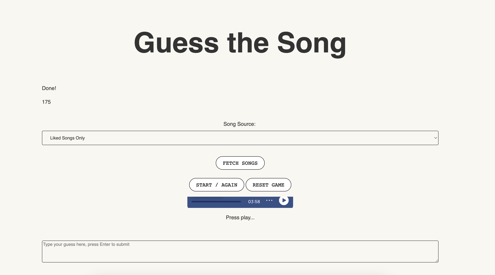

# guess-the-song

Spotify Guess the Song using the API for songs you listen to

## About

Fun game in which you are presented with a random song from your spotify and you have to guess what it is. Uses the spotify API. Simple web project.

## Usage

Visit [https://jblitzar.github.io/guess-the-song/](https://jblitzar.github.io/guess-the-song/)!
It will request oath scope access using the Spotify API. Go ahead and click through. Then select which option you want. Finally, click start. The instructions should take you from there.

If you're reviewing this and get an error, please open console! This is going to sound really bad, but reproduction has been hard. I've been through like three rounds of review. I'm not resubmitting blindly; I actually believe the errors are fixed each time. Then again, you're moderators, not QA. It's my job to get my act together. I'm trying my best, thanks for all your patience.

## AI

I mostly didn't use AI when developing this project. At the end, I wanted to add a feature where you can change the source, and I used AI for that. And also for bug fixing.
